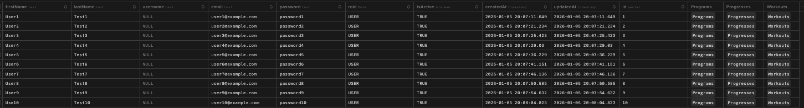

### INSTRUCUTION POUR LES TESTS

Dans le dossier `backend\src\tests`, vous trouverez plusieurs tests manuels, avec le suffixe`.rest`, pour les différents contrôleurs. Chaque test porte un nom différent.

Pour faciliter les tests, **j’ai rempli la base de données avec 10 lignes** pour chaque table, donc n’importe quel nombre entre 1 et 10 fonctionnera pour les IDs partout où vous voyez : remplace_par_x_id.

# ⚠️ Exception : 
Pour le CRUD des utilisateurs (`User`), vous pouvez utiliser un nombre supérieur à 10 ou celui qui sera généré automatiquement pour tester complètement les opérations de création, mise à jour et suppression.
