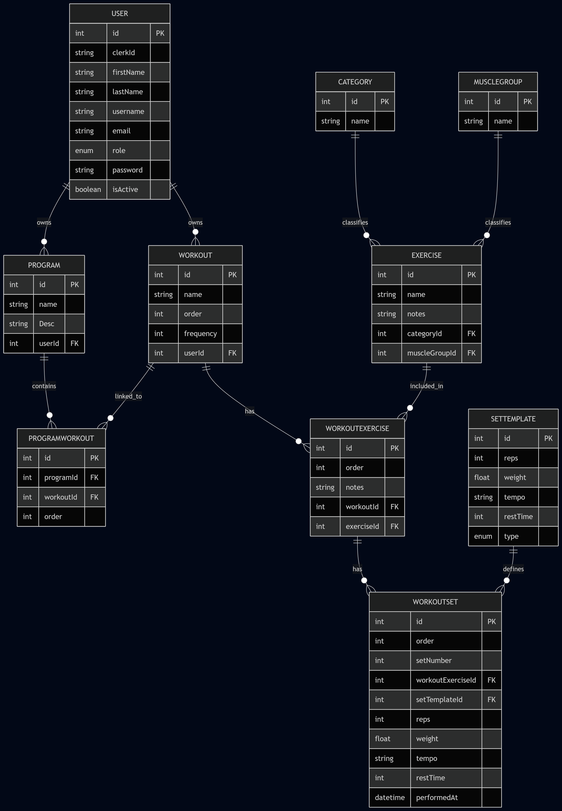

# Workout Log

Lien : https://workoutlog-c5r8.onrender.com

## Aperçu

**État global :** En développement  

**Backend :** Complet  
**Frontend :** En développement  

**Authentification :** Implémentée avec **Clerk**  

---

## Fonctionnalités

### Onglet Accueil
- Parcourir une liste complète d’exercices.  
- Filtrer les exercices par **catégorie** ou **groupe musculaire**.  
- Créer vos **propres exercices**.  
- Créer un **entraînement** en regroupant plusieurs exercices et en ajoutant des séries à chaque exercice.  
- Créer un **programme** en utilisant les entraînements que vous avez créés.  

### Onglet Mes Programmes
- Créer un nouveau **programme**.  
- Sélectionner un programme existant pour voir tous les **entraînements** et **exercices** qui y sont associés.  

---

## Fonctionnalités à venir
- Plus d’onglets pour chaque entité majeure : **Mes Exercices**, **Mes Entraînements**, etc.  
- Amélioration de la mise en page et plus de **flexibilité pour l’utilisateur**.  

---

## Diagramme ER

---

## Instructions de test

Pour les instructions de test, veuillez consulter le fichier :  
`backend/src/tests/1testInstruction.md`